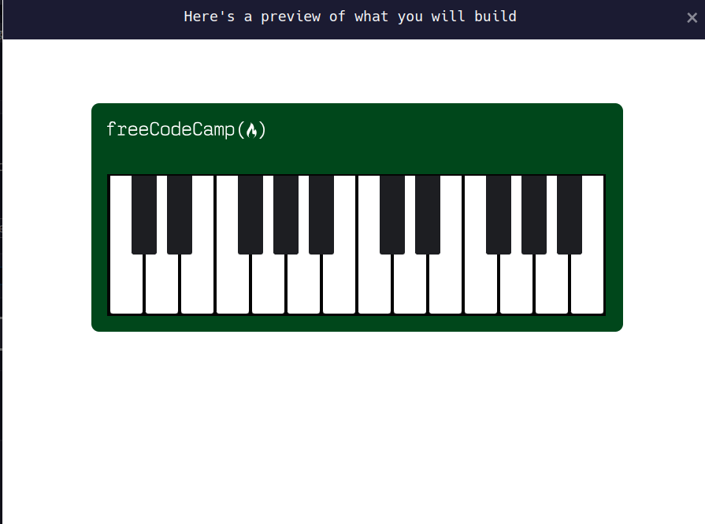

# Learn Responsive Web Design by Building a Piano

Responsive Design tells your webpage how it should look on different-sized screens.

In this course, I'll use CSS and Responsive Design to code a piano. I'll also learn more about media queries and pseudo selectors.

