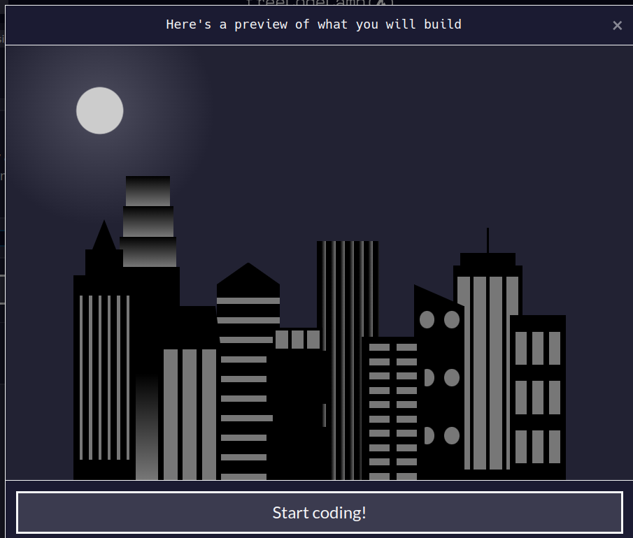

# CSS variables help you organize your styles and reuse them.

In this course, I'll build a city skyline (see the image below) in 118 steps. 
I'll learn how to configure CSS variables so I can reuse them whenever I want.

