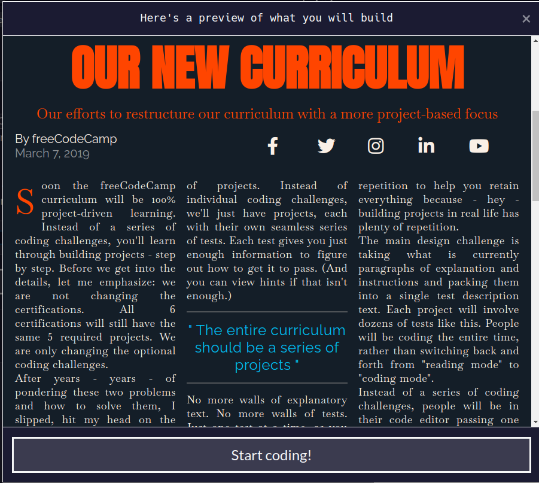
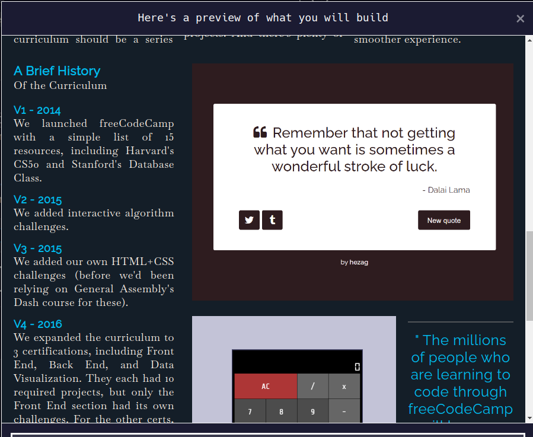
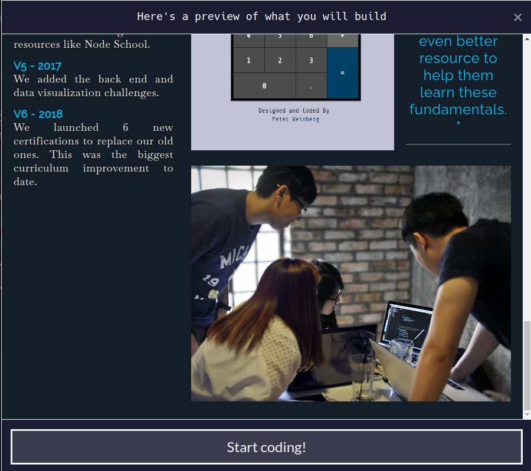

# Building a Magazine

CSS Grid gives you control over the rows and columns of your webpage design.

In this course, I'll build a magazine article. In 80 steps, I'll learn how to use CSS Grid, including concepts like grid rows and grid columns.

